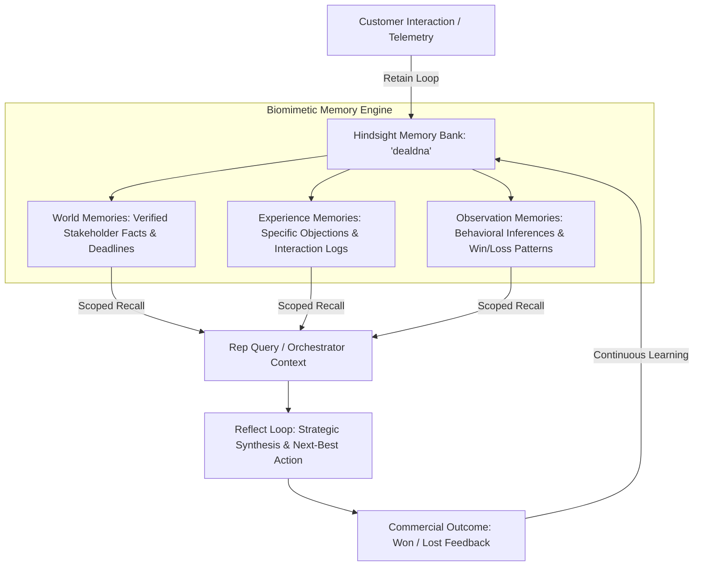

# DealMindAI

Most enterprise sales assistants are essentially glorified text wrappers around stateless LLM calls. If a customer mentions an aggressive pricing constraint in an introductory call in June, and an economic buyer raises a contractual requirement in August, conventional retrieval systems typically either miss the connection or drown the prompt context in hundreds of irrelevant chunked tokens.

When we designed DealMindAI, we set out to solve a specific problem: enterprise B2B sales cycles run for months across fragmented stakeholders, yet language models inherently suffer from conversational amnesia. Instead of building yet another standard RAG pipeline that treats meeting notes as generic text documents, we built a stateful sales intelligence engine with persistent cognitive memory powered by [Vectorize agent memory](https://vectorize.io/what-is-agent-memory) and the open-source [Hindsight GitHub repository](https://github.com/vectorize-io/hindsight).

Here is how we structured the system, why naive vector search failed our early tests, and how we implemented biomimetic memory loops in production.

---

## What the System Does and How It Hangs Together

DealMindAI sits between raw interaction telemetry (CRM notes, emails, call summaries) and revenue leadership. It tracks deal progression, maps stakeholder dynamics, and recommends tactical next actions based on factual precedents rather than generic sales advice.

Architecturally, the system is divided into three primary layers:

1. **Ingestion & State Layer (FastAPI + PostgreSQL)**: Receives CRM interaction events, normalizes metadata, and maintains relational models for companies, deals, touchpoints, and commercial outcomes.
2. **Cognitive Memory Layer**: Houses a dedicated memory bank (`dealdna`) powered by Hindsight. As detailed in the [Hindsight documentation](https://hindsight.vectorize.io/), the engine categorizes deal interactions into distinct memory types: *World* memories (verifiable facts about budgets, organizational hierarchy, and constraints), *Experience* memories (chronological interaction logs and stakeholder pushback), and *Observation* memories (inferred buyer tendencies and behavioral patterns).
3. **Execution & Reasoning Orchestrator**: A multi-model pipeline that accepts rep queries, issues semantic and tag-scoped recall requests to Hindsight, evaluates retrieved evidence, and generates actionable strategic next steps.

```
[ CRM Telemetry / Rep Input ]
              │
              ▼
   [ FastAPI Orchestrator ]
              │
     ┌────────┴────────┐
     ▼                 ▼
[ PostgreSQL ]   [ Hindsight Cloud API ]
(Structured DB)   ├── Retain: Entity extraction & temporal tagging
                  ├── Recall: Multi-arm vector & graph retrieval
                  └── Reflect: Cognitive reasoning loop
```



---

## The Core Problem: Why Naive RAG Fails in Sales Cycles

In typical RAG pipelines, developers chunk documents into 500-token windows, compute dense vector embeddings, store them in a vector database, and retrieve top-$k$ nearest neighbors via cosine similarity.

When applied to high-stakes sales cycles, this approach breaks down in three predictable ways:

1. **Loss of Temporal Authority**: If a CFO says *"We cannot afford $150k"* in March, but says *"We approved $175k now that SOC2 is verified"* in May, naive cosine similarity considers both chunks equally relevant. It has no intrinsic concept of state transition.
2. **Entity Conflation**: Sales conversations involve dozens of names—internal reps, technical evaluators, legal counsel, and third-party competitors. Generic dense embeddings frequently match on overlapping vocabulary without preserving which stakeholder owns which constraint.
3. **Lack of Synthetic Reflection**: Sales reps do not need a list of search snippets; they need to know what those facts mean when combined. A human sales director connects a technical blocker from an engineering lead to an ROI question from a CFO. Vector similarity alone cannot perform that synthesis.

To solve this, we decoupled transient prompt context from long-term institutional memory, implementing a three-phase cognitive loop: **Retain**, **Recall**, and **Reflect**.

---

## Implementation Details

### 1. Ingestion and Fact Extraction (Retain)

Whenever an interaction occurs, DealMindAI commits the event to PostgreSQL and simultaneously submits it to the Hindsight memory bank. 

We avoid manual tagging or regex-based extraction. Instead, we structure the payload with explicit entity scope and pass it to Hindsight's retain endpoint (`/v1/default/banks/{bank_id}/memories`). Hindsight runs background entity resolution and temporal extraction:

```python
# app/modules/memory/hindsight_adapter.py

def retain(
    self,
    deal_id: str,
    content: str,
    interaction_id: Optional[str] = None,
    memory_type: str = "Experience",
    metadata: Optional[Dict[str, Any]] = None,
    bank_id: Optional[str] = None,
) -> str:
    target_bank = bank_id or self.default_bank_id
    doc_id = f"mem-{uuid.uuid4().hex[:8]}"

    if self.api_key:
        try:
            meta_payload = {k: str(v) for k, v in (metadata or {}).items()}
            meta_payload["deal_id"] = str(deal_id)
            meta_payload["type"] = str(memory_type)

            item_payload = {
                "content": content,
                "document_id": doc_id,
                "metadata": meta_payload,
                "tags": [deal_id, memory_type.lower()]
            }
            resp = httpx.post(
                f"{self.api_url}/v1/default/banks/{target_bank}/memories",
                headers={"Authorization": f"Bearer {self.api_key}", "Content-Type": "application/json"},
                json={"items": [item_payload], "async": False},
                timeout=15.0,
            )
            if resp.status_code == 200:
                logger.info("Retained memory to Hindsight bank '%s'", target_bank)
        except Exception as e:
            logger.warning("Live Hindsight retain failed (%s); fallback active", e)

    return doc_id
```

By ensuring that metadata values are strictly stringified and tagged with the `deal_id`, Hindsight isolates individual customer contexts while retaining organizational memory across the entire bank.

### 2. Multi-Arm Semantic Retrieval (Recall)

When querying deal history, we don't just blast an open search across all embeddings. We scope the query using tag filters while letting Hindsight’s hybrid retrieval arm (dense vectors, keyword match, and temporal windows) score relevance:

```python
# app/modules/memory/hindsight_adapter.py

def recall(
    self,
    query: str,
    deal_id: Optional[str] = None,
    memory_type: Optional[str] = None,
    limit: int = 10,
    bank_id: Optional[str] = None,
) -> List[Dict[str, Any]]:
    target_bank = bank_id or self.default_bank_id
    self._ensure_hydrated(target_bank, deal_id)

    if self.api_key:
        try:
            recall_payload: Dict[str, Any] = {
                "query": query,
                "max_tokens": 800,
            }
            if deal_id:
                recall_payload["tags"] = [deal_id]

            resp = httpx.post(
                f"{self.api_url}/v1/default/banks/{target_bank}/memories/recall",
                headers={"Authorization": f"Bearer {self.api_key}", "Content-Type": "application/json"},
                json=recall_payload,
                timeout=15.0,
            )
            if resp.status_code == 200:
                raw_results = resp.json().get("results", [])
                if raw_results:
                    return [
                        {
                            "id": r.get("id"),
                            "deal_id": r.get("metadata", {}).get("deal_id", deal_id),
                            "type": r.get("type", "experience").capitalize(),
                            "statement": r.get("text", ""),
                            "confidence": int(r.get("metadata", {}).get("confidence", 95)),
                            "entities": r.get("entities", []),
                            "score": round(float(r.get("scores", {}).get("final", 1.0)), 3),
                        }
                        for r in raw_results
                    ][:limit]
        except Exception as e:
            logger.warning("Live Hindsight recall failed (%s)", e)
```

The response includes extracted entities (`["Anita Shah", "Acme Technologies", "ROI"]`) alongside calibrated composite scores (`scores.final`), filtering out noise before context is constructed.

### 3. Synthesis via Reflection Loops (Reflect)

The most distinctive feature of our architecture is the `Reflect` operation. Rather than asking an external LLM to parse raw memories from scratch on every turn, we dispatch reflection requests directly to Hindsight (`POST /v1/default/banks/{bank_id}/reflect`).

Hindsight executes an internal reasoning cycle against the active memory bank, cross-referencing past won/lost patterns against current deal constraints:

```python
# app/modules/memory/hindsight_adapter.py

reflect_payload = {
    "query": query,
    "tags": [deal_id] if deal_id else None,
    "max_tokens": 600,
}

resp = httpx.post(
    f"{self.api_url}/v1/default/banks/{target_bank}/reflect",
    headers={"Authorization": f"Bearer {self.api_key}"},
    json=reflect_payload,
    timeout=20.0,
)
```

If the live reflection engine returns a synthesized deduction, DealMindAI maps it directly to strategic recommendations and caveats, citing exact evidence chains.

---

## Real-World Behavior: Connecting Broken Context

To test the system against real enterprise edge cases, we simulated a multi-stakeholder scenario across several weeks of interactions on an enterprise deal (`DEAL-1007` with Acme Technologies):

1. **Touchpoint A**: VP of Engineering Marcus Vance confirmed that DealMindAI passed their internal SOC2 compliance review and approved technical rollout for Q4.
2. **Touchpoint B**: CFO Anita Shah stated that she would not approve a $175,000 contract without an ROI validation study demonstrating payback within 12 months, setting a hard review deadline of October 6.

When we interrogated the agent through our verification suite (`python verify_hindsight.py`):

> **Query**: *"What is the security and compliance readiness for DEAL-1007, and what is blocking contract sign-off?"*

Here is the exact synthesis generated by the reflect loop:

```
### Security and Compliance Status for DEAL-1007
As of September 29, 2026, the security and compliance readiness for DealMindAI has been formally verified and approved.

#### Verification Details
* Compliance Standard: The platform has achieved SOC2 compliance.
* Verification Authority: Marcus Vance, the VP of Engineering, personally verified compliance and approved Q4 rollout.

#### Contextual Financial Considerations
While technical security readiness is confirmed, deployment for Acme Technologies ($175,000 ARR) remains gated by financial validation. 
CFO Anita Shah has requested an executive ROI analysis to address concerns regarding the 12-month payback period. Project timeline is currently synchronized with an ROI validation study that must be completed by October 6, 2026, as authorized by the CFO.
```

The system did not simply echo snippets. It recognized that while engineering risk was eliminated by Marcus Vance, financial risk was independently held by Anita Shah, and correctly identified the critical path milestone: **October 6, 2026**.

---

## Lessons Learned

### 1. Zero Canned Fallbacks Enforces Architecture Discipline
Early in the project, we had fallback text blocks in our orchestrator that returned canned advice when upstream services timed out. We removed every single fallback. If a provider failed or credentials were misconfigured, the agent was forced to propagate the exact HTTP error code. 

Eliminating fallback masks surfaced real integration issues immediately—including URL route mismatches and type mismatches in metadata payloads—that would have otherwise remained hidden behind boilerplate text.

### 2. Strict Metadata Serialization Is Mandatory
Hindsight's API schema requires that custom metadata dictionaries contain string values. Passing an integer (e.g., `{"confidence": 95}`) triggered HTTP 422 validation errors. Normalizing all metadata attributes at the adapter boundary (`{k: str(v) for k, v in metadata.items()}`) made our data pipelines resilient across heterogeneous CRM payloads.

### 3. Dynamic Model Routing Mitigates Upstream Deprecations
LLM provider catalogs shift rapidly. During development, models we relied on were decommissioned upstream (such as older LLaMA checkpoints on Groq). Building a decoupled fallback chain—OpenAI reasoning models descending to Gemini 2.5 Flash and Groq LLaMA 3.3—ensured that temporary provider outages never halted agent evaluation.

### 4. Memory Partitioning Prevents Cross-Deal Leakage
Enterprise teams cannot tolerate cross-customer context leakage. Using bank-level namespaces (`bank_id: dealdna`) combined with strict tag scoping (`tags: [deal_id]`) ensured that semantic searches within one opportunity never retrieved competitor intelligence or private stakeholder facts from an adjacent deal.

---

## Looking Forward

Enterprise software is rapidly moving past simple conversational wrappers. By offloading state tracking and long-term reasoning to dedicated cognitive memory engines like [Hindsight](https://github.com/vectorize-io/hindsight), we can build software that actually remembers the commitments made across long sales cycles.

The complete codebase, schema definitions, and verification scripts are available on GitHub: [https://github.com/Vishnu-814271/DealDNA.git](https://github.com/Vishnu-814271/DealDNA.git).
