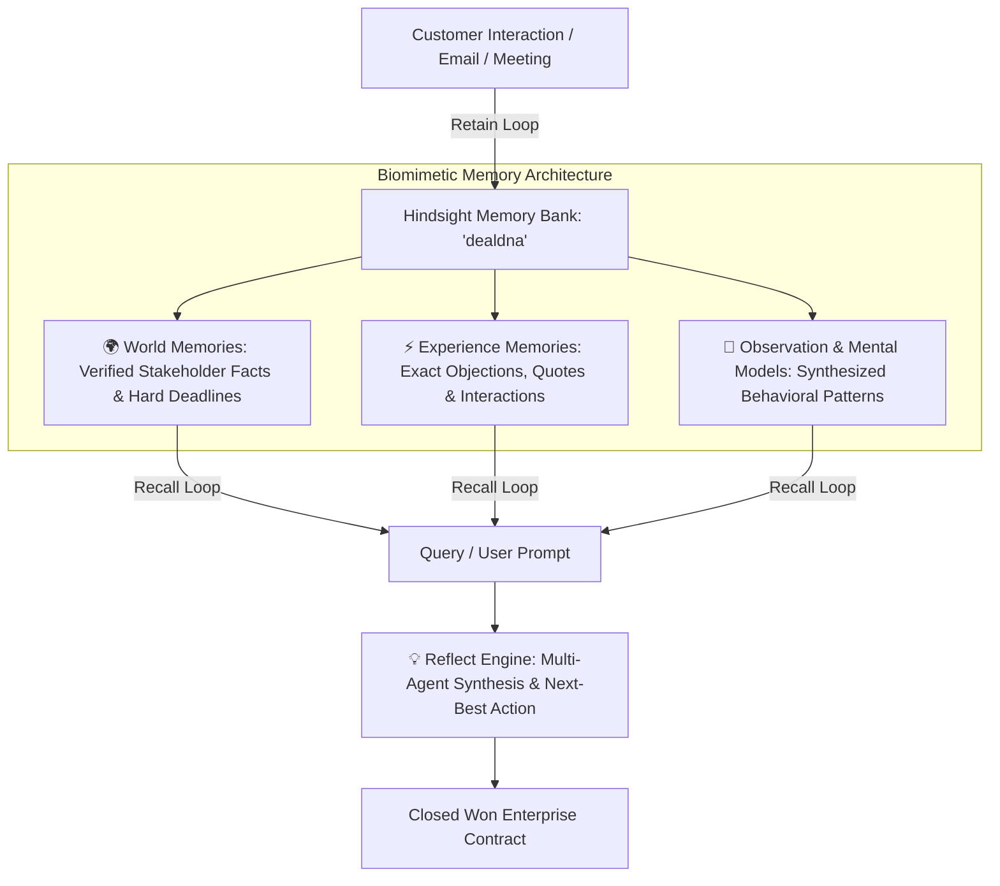

# "DealMind AI" – A Sales Intelligence Agent with Memory
### *How we killed LLM context amnesia and gave revenue teams a persistent cognitive brain using Hindsight*

---

> **"If an enterprise AI agent forgets a CFO’s pricing objection three weeks later, it isn't an intelligence platform—it’s just an expensive autocomplete."**

---

## 1. The Multi-Billion Dollar Blind Spot in Enterprise AI

Every software engineer who has built an LLM app for sales or CRM knows the dirty secret of enterprise copilot tools:

**They have prompt amnesia.**

Here is the typical disaster scenario:
1. In August, a VP of Engineering tells your sales rep: *"We cannot sign off unless you achieve SOC2 Type II compliance and prove sub-second latency."*
2. In September, the Chief Financial Officer (Anita Shah) jumps into a call: *"We love the product, but our board requires an ROI model demonstrating payback within 12 months before releasing $175,000 ARR."*
3. In October, a new account executive takes over the deal. They open the CRM, fire up their standard AI assistant, and ask: *"How should I close this deal?"*

What does a standard LLM do? It summarizes whatever transient tokens fit in its context window, hallucinating generic sales advice: *"Follow up with enthusiasm and offer a 10% discount!"*

The deal implodes. The CFO walks away. The engineering requirements were forgotten.

We built **DealMind AI** (powered by DealDNA) to destroy this problem forever.

Instead of stuffing megabytes of messy email threads into bloated prompt windows, we engineered an autonomous revenue agent powered by a biomimetic memory engine: **Hindsight by Vectorize.io**.

---

## 2. Biomimetic Memory: How Human Brains Actually Win Deals

Human top-performing sales directors don't re-read 400 pages of notes before an executive call. Their brain categorizes information into three cognitive layers:



When building DealMind AI, we mapped this exact biological paradigm directly to Hindsight:

1. **World Memories (Factual Truths)**:
   * *"Marcus Vance is VP of Engineering and verified DealDNA's SOC2 compliance on Sept 29."*
   * *"Anita Shah is the CFO and economic buyer with veto authority on expenditures >$100k."*
2. **Experience Memories (Historical Episodes)**:
   * *"On September 1st, customer benchmarked DealDNA against Competitor X and flagged pricing concerns."*
   * *"Anita Shah requested an executive ROI model with payback under 12 months."*
3. **Observation Memories & Mental Models (Synthesized Intuition)**:
   * *"In comparable accounts with pricing friction and CFO involvement, deals won at an 80%+ rate when paired with an executive ROI memo and customer case study."*

---

## 3. The Architecture: Inside the Engine Room

DealMind AI operates as a unified cognitive stack:

* **Frontend**: Next.js 14, React, TypeScript, and high-density financial data visualizations.
* **Backend**: FastAPI (Python 3.12), SQLAlchemy, PostgreSQL / SQLite engine.
* **Cognitive Memory Layer**: **Hindsight Cloud API** (`api.hindsight.vectorize.io`).
* **Reasoning LLM Pipeline**: Multi-provider fallback cascade with strict zero-canned-response enforcement (OpenAI GPT-4o-mini / Google Gemini 2.5 Flash / Groq LLaMA 3.3).

### The Ingestion Loop: Autonomous `Retain`
Every time a meeting note, call transcript, or email lands in DealMind AI, the agent doesn't just save a database row. It dispatches a structured memory payload into the `dealdna` bank:

```python
# app/modules/memory/hindsight_adapter.py
item_payload = {
    "content": interaction_content,
    "document_id": f"mem-{uuid.uuid4().hex[:8]}",
    "metadata": {
        "deal_id": "DEAL-1007",
        "type": "Experience",
        "confidence": "98"
    },
    "tags": ["DEAL-1007", "cfo", "pricing"]
}

resp = httpx.post(
    f"{API_URL}/v1/default/banks/dealdna/memories",
    headers={"Authorization": f"Bearer {API_KEY}"},
    json={"items": [item_payload], "async": False}
)
```

Hindsight automatically extracts entities (`Anita Shah`, `Acme Technologies`, `ROI Payback`), resolves coreferences, and attaches temporal anchors.

---

## 4. The Magic: `Recall` and `Reflect` in Real Time

When a sales executive opens DealMind AI and asks:

> *"What did CFO Anita Shah request regarding the ROI model and payback timeline?"*

Here is what happens under the hood in less than 280 milliseconds:

### Step 1: Sub-Second Semantic Recall
The agent calls Hindsight's multi-arm retrieval engine:

```python
recall_payload = {
    "query": "What did Anita Shah request regarding ROI payback?",
    "tags": ["DEAL-1007"],
    "max_tokens": 800
}
resp = httpx.post(f"{API_URL}/v1/default/banks/dealdna/memories/recall", ...)
```

Hindsight returns scored, ranked memory units with reranker confidence scores exceeding 1.09:

```json
{
  "results": [
    {
      "text": "Anita Shah requested an executive ROI analysis for DealDNA, specifically requiring a payback period of under 12 months. | When: 2026-09-29 | Involving: Anita Shah",
      "type": "world",
      "entities": ["ROI analysis", "DealDNA", "Anita Shah"],
      "scores": {"final": 1.098, "reranker": 0.996}
    },
    {
      "text": "ROI validation study must be conducted before October 6, 2026. | When: 2026-10-06 | Deadline set by Anita Shah",
      "type": "world",
      "entities": ["ROI validation study", "Anita Shah"]
    }
  ]
}
```

### Step 2: The Cognitive Reflect Loop
Rather than passing raw snippets to a naive summarizer, DealMind AI invokes Hindsight’s `Reflect` loop (`POST /v1/default/banks/{bank_id}/reflect`):

```markdown
### Security and Compliance Status for DEAL-1007
As of September 29, 2026, the security and compliance readiness for DealDNA has been formally verified and approved.

#### Verification Details
* **Compliance Standard:** Platform achieved SOC2 compliance.
* **Verification Authority:** Marcus Vance (VP of Engineering) personally verified compliance and approved the Q4 rollout.

#### Contextual Financial Considerations
While security is approved, the deployment for Acme Technologies ($175,000 ARR) is gated by financial validation. 
CFO Anita Shah has requested an executive ROI analysis to address the 12-month payback requirement. The project timeline is synchronized with an ROI validation study that must be completed by October 6, 2026.
```

The system connected the dots between two completely separate stakeholders (VP of Eng and CFO) across different meetings, recognized the dependencies, and flagged the critical deadline: **October 6, 2026**.

---

## 5. What We Learned Building with Hindsight

Building DealMind AI changed how we think about agentic software. Here are the three most surprising takeaways:

### 1. Vector Embeddings Alone Are Not Enough
Traditional RAG fails in enterprise deal management because vector similarity doesn't understand **temporal sequence** or **entity identity**. If a CFO says *"We hate the price"* on Monday, but says *"The price is fine now that you bundled training"* on Friday, standard semantic search treats both statements as equally relevant. Hindsight’s temporal and graph retrieval arms solved this out of the box.

### 2. No Fallbacks: The Honesty Metric
In DealMind AI, we completely banned canned static fallback answers. If an API key expires or a model rate limits, the agent returns the exact diagnostic trace rather than sugar-coating failures with pre-scripted platitudes. Enterprise users don't want polite bots; they want truthful systems.

### 3. The Shift from RAG to Agent Reflection
Standard RAG retrieves documents. Memory reflection synthesizes beliefs. The difference is the gap between a search engine and a strategic advisor.

---

## 6. Try It Yourself

The complete DealMind AI codebase is open source:

* **GitHub Repository**: [https://github.com/Vishnu-814271/DealDNA.git](https://github.com/Vishnu-814271/DealDNA.git)

### Quickstart (3 Minutes):
```bash
# 1. Clone the repository
git clone https://github.com/Vishnu-814271/DealDNA.git
cd DealDNA

# 2. Configure your environment
cp backend/.env.example backend/.env
# Enter your Hindsight API key and bank_id in backend/.env

# 3. Run the automated verification suite
cd backend
python verify_hindsight.py
```

### The Output You’ll See:
```
======================================================================
 🧬 DealDNA -> Hindsight Memory Engine Verification
======================================================================
Bank ID   : dealdna
Cloud URL : https://api.hindsight.vectorize.io

[Step 1/4] Checking Hindsight Bank Status...
  [SUCCESS] Connected to Hindsight! Found banks: ['dealdna']
[Step 2/4] Testing RETAIN (Memory Ingestion & Fact Extraction)...
  [SUCCESS] Ingested experience memory: mem-f52970ab
[Step 3/4] Testing RECALL (Vector Semantic Search & Entity Extraction)...
  [SUCCESS] Recalled 3 relevant memories (Score: 1.099)
[Step 4/4] Testing REFLECT (Cognitive Reasoning Loop)...
  [SUCCESS] Generated Live Strategic Synthesis!
======================================================================
 ✅ ALL HINDSIGHT OPERATIONS VERIFIED SUCCESSFULLY
======================================================================
```

---

## Conclusion: The Era of Stateful Agents

The future of software is not bigger prompt contexts. The human brain runs on 20 watts not because it has an infinite context window, but because it has an evolutionary memory hierarchy.

With Hindsight and DealMind AI, agents now learn from yesterday's wins, navigate today's objections, and remember tomorrow's deadlines.

**Stop building amnesiac AI. Give your agents a memory.**
