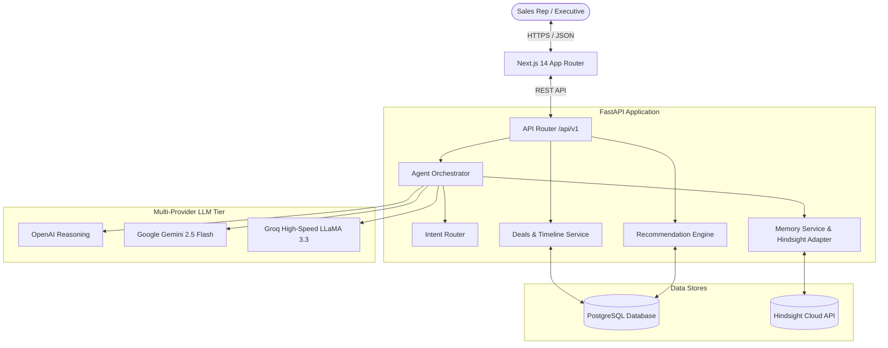
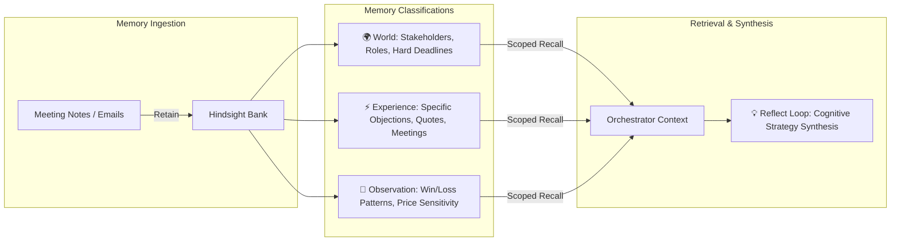

# DealDNA / DealMindAI Architecture Overview

## 1. System Mission

DealDNA is a stateful revenue intelligence platform designed to eliminate sales knowledge fragmentation across multi-month enterprise deals. It captures unstructured customer touchpoints, extracts structured facts, and retains them in a persistent cognitive memory bank powered by **Hindsight by Vectorize.io**.

---

## 2. Core Architectural Principles

1. **Dual-Store Paradigm**:
   - **PostgreSQL**: Serves as the system of record for transactional business truth (deals, stages, dollar values, contacts, timestamps).
   - **Hindsight Memory Engine**: Serves as the cognitive system of record for unstructured knowledge, temporal entity tracking, and cross-deal pattern learning.
2. **Context-Preceding Generation**: The Agent Orchestrator retrieves and scopes relevant memories *before* invoking any LLM prompt, preventing hallucinations.
3. **Strict Zero-Fallback Policy**: DealDNA does not mask integration issues or provider timeouts with static canned text.
4. **Isolated Multi-Tenancy**: Memories are strictly partitioned by `bank_id` (`dealdna`) and scoped by deal tags (`tags: [deal_id]`).
5. **Decoupled Client-Server**: The frontend communicates strictly via typed REST APIs (`/api/v1/*`); direct database or LLM provider calls from the browser are forbidden.

---

## 3. High-Level Architecture Diagram

---

## 4. Biomimetic Memory Layer

DealDNA implements Hindsight's biomimetic three-tier memory architecture:

* **World Memories**: Verifiable facts regarding external reality (e.g., *"Marcus Vance is VP of Engineering and confirmed SOC2 compliance"*).
* **Experience Memories**: Episodic memories tied to interactions (e.g., *"CFO Anita Shah requested an ROI validation study demonstrating payback within 12 months"*).
* **Observation Memories**: Inferred beliefs and synthesized patterns (e.g., *"In comparable deals with pricing friction, providing an executive ROI memo increases win probability by 80%"*).

---

## 5. Service Modules Breakdown

| Module | Location | Purpose |
| :--- | :--- | :--- |
| **API Endpoints** | [`backend/app/api/v1/endpoints/`](file:///c:/Users/vishn/Desktop/DealDNA/backend/app/api/v1/endpoints/) | REST endpoints for Deals, Interactions, Memory, Recommendations, and Agent Chat |
| **Memory Adapter** | [`backend/app/modules/memory/hindsight_adapter.py`](file:///c:/Users/vishn/Desktop/DealDNA/backend/app/modules/memory/hindsight_adapter.py) | Connects to Hindsight Cloud REST endpoints (`/memories`, `/recall`, `/reflect`) |
| **Agent Orchestrator** | [`backend/app/modules/agents/orchestrator.py`](file:///c:/Users/vishn/Desktop/DealDNA/backend/app/modules/agents/orchestrator.py) | Intent classification, memory hydration, and live LLM multi-provider reasoning |
| **Context Builder** | [`backend/app/modules/agents/context_builder.py`](file:///c:/Users/vishn/Desktop/DealDNA/backend/app/modules/agents/context_builder.py) | Structures timelines, stakeholder profiles, and recalled memories into LLM prompt contexts |
| **Deals Service** | [`backend/app/modules/deals/service.py`](file:///c:/Users/vishn/Desktop/DealDNA/backend/app/modules/deals/service.py) | Manages pipelines, stages, win/loss status transitions, and timeline interactions |

---

## 6. End-to-End Operational Lifecycle

1. **Ingest & Retain**: Rep inputs a call summary. Deals service persists to PostgreSQL; Hindsight adapter extracts entities and vectorizes into the `dealdna` bank.
2. **Intent Routing**: When a rep queries the agent, the intent router classifies the query into `FACTUAL`, `SUMMARY`, `STRATEGY`, or `PATTERN`.
3. **Recall**: Scoped vector and keyword search queries Hindsight with `tags: [deal_id]` to fetch relevant memories with rerank scores.
4. **Reflect**: For strategic queries, the orchestrator triggers Hindsight's cognitive reflection loop (`POST /v1/default/banks/{bank_id}/reflect`).
5. **Synthesis**: Live LLM constructs the final response citing specific evidence items and caveats.
6. **Closed Loop Outcome**: When a deal closes (`WON` / `LOST`), the outcome, strategy used, and rationale are retained back into Hindsight to improve recommendations across future deals.
